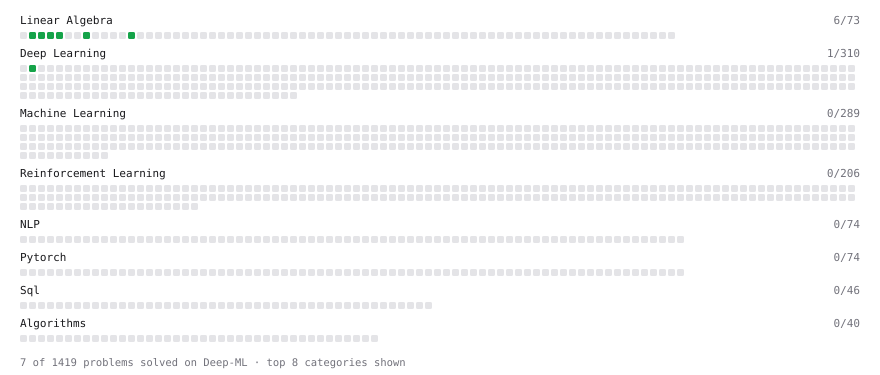

# Deep-ML

My machine learning practice from [Deep-ML](https://www.deep-ml.com). Every solution here was written by hand.

**8** solved · 7 problems · 0 labs · 1 math

[**Browse the interactive portfolio**](https://Lalithaditya007.github.io/deep-ml/) to replay this filling in over time.

## Problems

| | Difficulty | Solved | |
| --- | --- | --- | --- |
| [Calculate 2x2 Matrix Inverse](https://www.deep-ml.com/problems/8) | easy | 2026-09-20 | [solution](problems/0008-calculate-2x2-matrix-inverse) |
| [Calculate Mean by Row or Column](https://www.deep-ml.com/problems/4) | easy | 2026-09-20 | [solution](problems/0004-calculate-mean-by-row-or-column) |
| [Reshape Matrix](https://www.deep-ml.com/problems/3) | easy | 2026-09-20 | [solution](problems/0003-reshape-matrix) |
| [Scalar Multiplication of a Matrix](https://www.deep-ml.com/problems/5) | easy | 2026-09-20 | [solution](problems/0005-scalar-multiplication-of-a-matrix) |
| [Softmax Activation Function Implementation ](https://www.deep-ml.com/problems/23) | easy | 2026-09-21 | [solution](problems/0023-softmax-activation-function-implementation) |
| [Transformation Matrix from Basis B to C](https://www.deep-ml.com/problems/27) | easy | 2026-09-20 | [solution](problems/0027-transformation-matrix-from-basis-b-to-c) |
| [Transpose of a Matrix](https://www.deep-ml.com/problems/2) | easy | 2026-09-20 | [solution](problems/0002-transpose-of-a-matrix) |

## Math

| | Difficulty | Solved | |
| --- | --- | --- | --- |
| [Derivatives and Gradients](https://www.deep-ml.com/math-problems/1) | easy | 2026-09-20 | [solution](math/0001-derivatives-and-gradients) |

---

_This file is regenerated by Deep-ML on every push._
